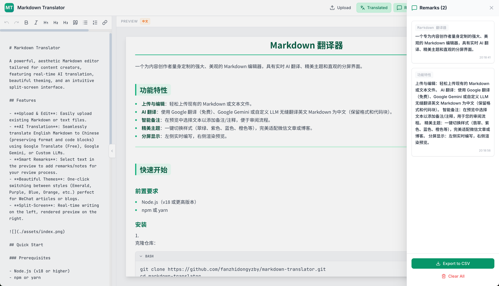

# Markdown Translator

A powerful, aesthetic Markdown editor tailored for content creators, featuring real-time AI translation, beautiful theming, and an intuitive split-screen interface.

## Features

- **Upload & Edit**: Easily upload existing Markdown or text files.
- **AI Translation**: Seamlessly translate English Markdown to Chinese (preserving format and code blocks) using Google Translate (Free), Google Gemini, or Custom LLMs.
- **Smart Remarks**: Select text in the preview to add remarks/notes for your review process.
- **Beautiful Themes**: One-click switching between styles (Emerald, Purple, Blue, Orange, etc.) perfect for WeChat articles or blogs.
- **Split-Screen**: Real-time writing on the left, rendered preview on the right.



## Quick Start

### Prerequisites

- Node.js (v18 or higher)
- npm or yarn

### Installation

1. Clone the repository:
    ```bash
    git clone https://github.com/fanzhidongyzby/markdown-translator.git
    cd markdown-translator
    ```

2. Install dependencies:
    ```bash
    npm install
    ```

3. Start the development server:
    ```bash
    npm run dev
    ```
    Access the app at `http://localhost:3000`.

## Configuration

To use the AI translation features effectively:

1. Click the **Settings** (Gear icon) in the top right.
2. **Google Translate (Free)**: No configuration needed.
3. **Google Gemini**: Enter your API Key from Google AI Studio.
4. **OpenAI / Custom**: Configure your own endpoint and Key.

## License

Apache 2.0
